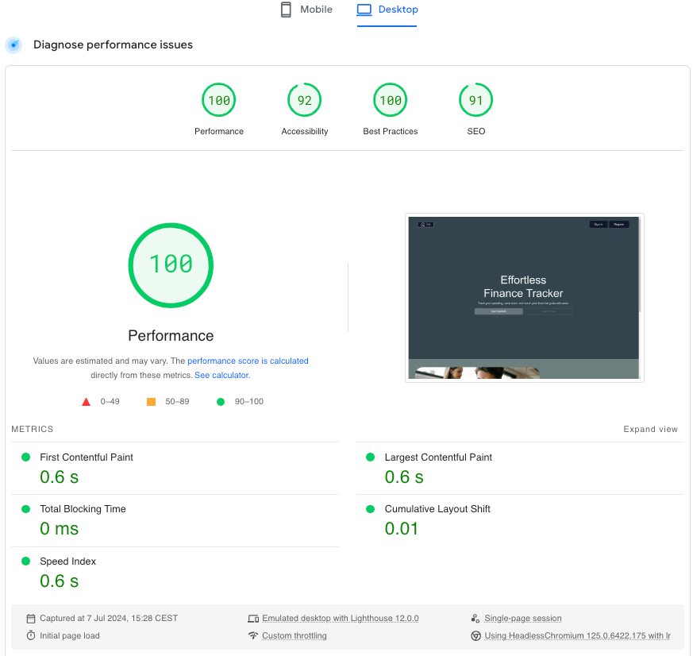

<h1>Track My Spending</h1>

## Description 

**Track My Spending(TMS)** 
This Django project is a web-based expense tracker application that allows users to create and manage their personal budgets. Users can set up budgets for different expense categories and track their daily transactions by entering purchases. The application provides a simple and intuitive interface for users to monitor their spending habits and stay within their budget.

Login: [TMS](https://track-my-spending-2651d262fa88.herokuapp.com/)

## Table of Content 

1. [Description](#description)
2. [Table of Content](#table-of-content)
3. [Design](#design)
4. [Features](#features)
5. [Data Model](#data-model)
6. [Libraries:](#libraries)
7. [Testing](#testing)
8. [Bugs](#bugs)
9. [Deployment](#deployment)
10. [Credits and Acknowledgements](#credits-and-acknowledgements)

## Design 
**Figma**

[PP4 Figma Degsin](https://www.figma.com/design/nj7ZJ0YwtFegix8X4PegVN/PP4?m=dev&node-id=0-1&t=983Wc5eoFBOCKgxO-1)
## Features
**Budget Management**
  The project includes a BudgetForm that allows users to input their income, expense, allowance, monthly saving, goal saving, and goal saving item. Displaying budget within a table format.

**Transaction Management**
  The project includes a TransactionForm that allows users to input their transaction amount, location, and category. Displaying transaction within a table format.

**Chart Integration**
  The project includes a chart feature that allows users to visualize their transaction data.
  The chart is integrated with the transaction forms to provide a seamless user data.

[TMS](https://track-my-spending-2651d262fa88.herokuapp.com/)

## Data Model 
The core functionality of TMS (Transaction Management System) is built around two essential models that empower users to:
These two models are:
- Budget Model
- Transaction Model
  

Database Rational Diagram

## Libraries:
**For APIs and Intergrations:**
- Request (for making HTTP Request)

**For Database Management:**
- Django's built-in ORM (Object-Relational Mapping) system
- Dj-database-url (for database URL parsing)
- ElephantSQL (for PostgreSQL database hosting)
- Psycopg2 (for PostgreSQL database connections)
  
**For Authentication Management:**
- Django Allauth (for authentication and authorization)

**For Web Development:**
- Django Framework
- Django Crispy Forms (form rendering and validation)
- Crispy Bootsrap5 (Bootstrap5 intergration)
- Whitenoise (serving static files)

**Utilities and Tools:**
- [Refer to requirements.txt](./requirements.txt)

## Testing
Testing of Track My Spending was done manually by:
- Ran code through a [PEP8](https://pep8ci.herokuapp.com/) linter with no major issues.  
- Performance Diagnostic: [PageSpeed Insights](https://pagespeed.web.dev/analysis/https-track-my-spending-2651d262fa88-herokuapp-com/c8z0i67r3c?form_factor=desktop)

## Bugs
- Used [ChatGBT](https://chat.openai.com/) for debugging and help with fixing code errors with more advanced sytanx.
- Minor linting errors with-in Apps view.py are still present.
- Only one bug found with one notification message displayed not a real ran out of time to solve the issue(DOES NOT EFFECT PROGRESS OF THE APP FLOW). Will have to resolve later. User is able to remove when neccessary.
  
## Deployment 
This project is designed to be deployed on [HEROKU](heroku.com/apps) using a Dyno. To deploy, follow these steps:
  1. Create a new Heroku app and add a Dyno.
  2. Install the Heroku CLI and login to your account.
  3. Create a Procfile with web: gunicorn track_my_spending.wsgi
  4. Deployed to [HEROKU](heroku.com/apps) using [GitHub branch](https://github.com/CraigB73/track-my-spending.git). 
    
  5. Link the Heroku app to [GitHub repository](https://github.com/CraigB73/track-my-spending.git)

Track My Money: [TMS](https://track-my-spending-2651d262fa88.herokuapp.com/)

## Credits and Acknowledgements
- [ChatGBT](https://chat.openai.com/) 
- [Django](https://docs.djangoproject.com/en/5.0/)
- Used text from [Code Institute](https://codeinstitute.net/se/) README.md from deployment section.

