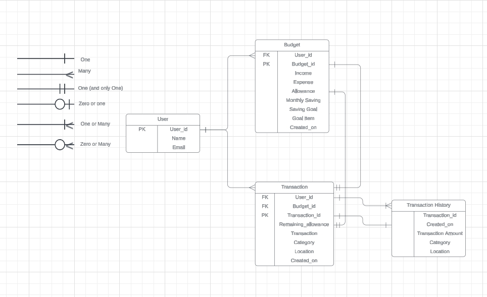

<h1>Track My Spending</h1>

## Description 

**Track My Spending(TMS)** 

Login: [TMS](https://track-my-spending-2651d262fa88.herokuapp.com/)

## Table of Content 

1. [Description](#description)
2. [Table of Content](#table-of-content)
3. [Features](#features)
4. [Data Model](#data-model)
5. [Libraries.](#libraries)
6. [Testing](#testing)
7. [Bugs](#bugs)
8. [Deployment](#deployment)
9. [Credits and Acknowledgements](#credits-and-acknowledgements)

## Features
features in the project as well up coming features

Login: [TMS](https://track-my-spending-2651d262fa88.herokuapp.com/)

## Data Model 
TMS main functionality is based of two models that provide the User a platform to
create a budget with a monthly allowance and track purchases made and categorize each purchase:

- Budget model
- Transaction model

Database Rational Diagram

## Libraries.
 *add Dj libraries/imports chartjs used in project*
## Testing
Testing of Mastermind was done manually by:
- Ran code through a [PEP8](https://pep8ci.herokuapp.com/) linter with no major issues.  
- Performed multiple run ups of the game entering various correct and incorrect inputs to check input validators.   
- Played the game multiple times to ensure that the attemp count updated correctly. 

## Bugs

- No bugs on deployment were detected.
  
## Deployment 
Deployment was performed using Code Institute's mock terminal for [HEROKU](heroku.com/apps).
- Deployment steps:
  1. Created Heroku app
  2. Settings
     - Config(Key: Port, Value: 8000)
     - Buildbacks to <mark>Python</mark> and <mark>NodeJS</mark> in order
  3. Link the Heroku app to [GitHub repository](https://github.com/CraigB73/track-my-spending.git)
  4. Click: <b>Deploy</B>

Track My Money: [TMS](https://track-my-spending-2651d262fa88.herokuapp.com/)

## Credits and Acknowledgements
- [ChatGBT](https://chat.openai.com/) 
- [Django](https://docs.djangoproject.com/en/5.0/)
- Used text from [Code Institute](https://codeinstitute.net/se/) README.md from deployment section.

